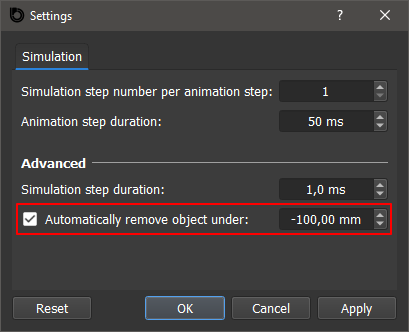
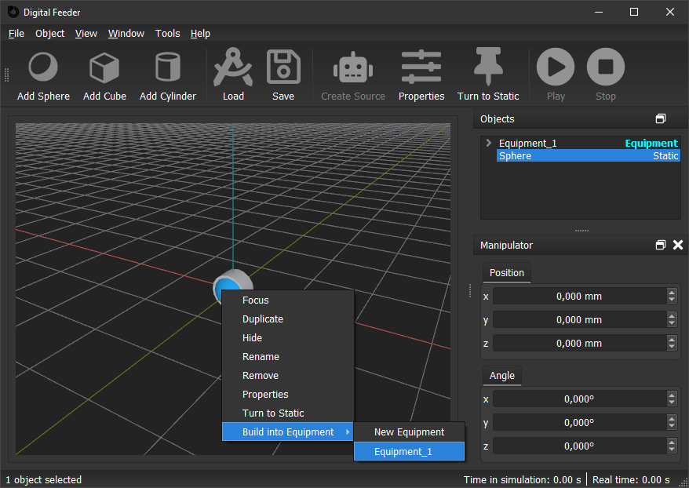
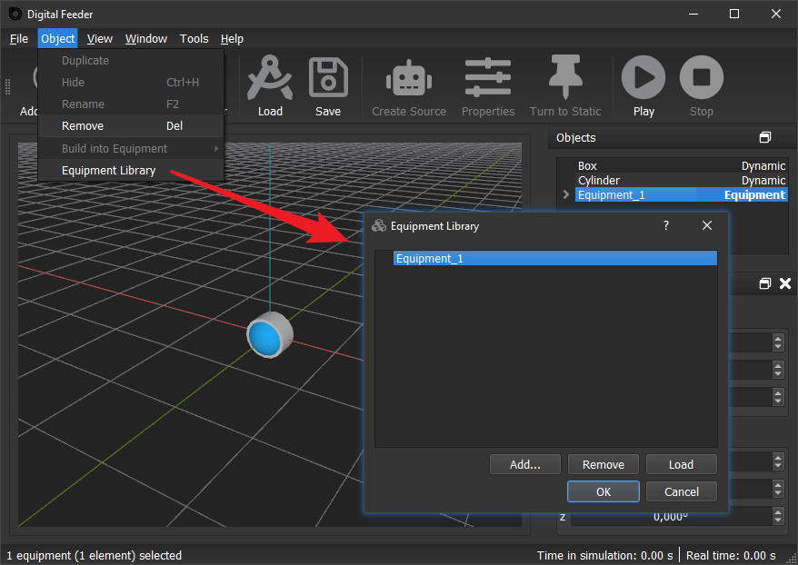
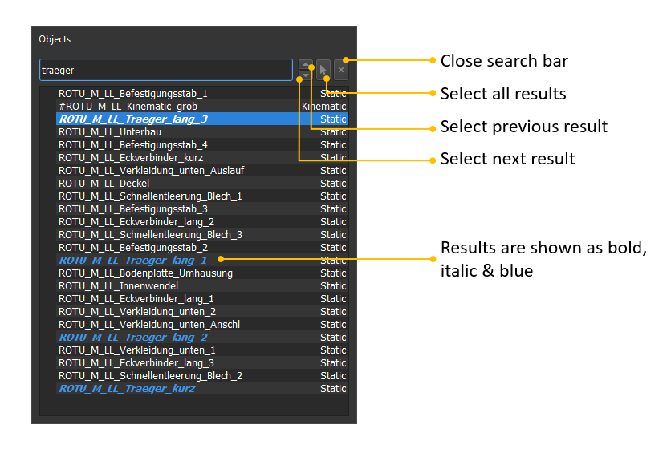

## Versions

- <a href="#1.14">v1.14</a>
- <a href="#1.13">v1.13</a>
- <a href="#1.12">v1.12</a>
- <a href="#1.11">v1.11</a>
- <a href="#1.10">v1.10</a>
- <a href="#1.9">v1.9</a>
- <a href="#1.8">v1.8</a>
- <a href="#1.7">v1.7</a>
- <a href="#1.6">v1.6</a>
- <a href="#1.5">v1.5</a>
- <a href="#1.4">v1.4</a>
- <a href="#1.3">v1.3</a>
- <a href="#1.2">v1.2</a>
- <a href="#1.1">v1.1</a>
- <a href="#1.0">v1.0</a>

  06.12.2022

## ✨ Digital Feeder 1.14.1 

### New Feature
- Label icon in toolbar.

### Improvements
- Larger upper limit for dynamic force for compressed air,
- Resized simulation speed slider and properties dialog window.

  30.09.2022

## ✨ Digital Feeder 1.14.0 

### New Feature
- Pattern.

### Fix
- Treeview could not display the loaded objects properly when loading a corrupt dfs file.

  25.09.2022

## ✨ Digital Feeder 1.13.1

### New Feature
- Feeding parameters for vibration.

  25.08.2022

## ✨ Digital Feeder 1.13.0

### New Features
- Circular analyser.
- Average line for in analyser status window.

### Improvement
- Show current color of the selected object when color selection dialog opens.

### Fix
- Crash sometimes when resetting scene, which contains equipment and analyser/compressed air/sink. 

  15.07.2022

## ✨ Digital Feeder 1.12.1

### Fix
- Crash when changing simplification of an object and then moving it.

  08.07.2022

## ✨ Digital Feeder 1.12.0

### New Feature
- Jammed objects detection: The dynamic objects (feeding parts), which get stuck in tooling or with each other, can be detected now. The detected object can be removed directly or marked in color.

  01.07.2022

## ✨ Digital Feeder 1.11.1

### New Feature
- Object tracking: Camera follows a specific feeding part, to make it easier to observe its behaviour.

### Fixes
- Margin value of custom object couldn't be loaded properly.
- COM shift for BSA caused freezing.

  17.06.2022

## ✨ Digital Feeder 1.11.0

### New Features
- Drag and drop treeviewitems
- Sort treeviewitems

### Improvement
- Added warning when trying to stop simulation

### Fix
- Sink timer couldn't be saved properly

  08.06.2022

## ✨ Digital Feeder 1.10.10.1

### Fix
- Bug with conical frustum

  27.05.2022

## ✨ Digital Feeder 1.10.10

### New Feature
- New animated loading indicator 

  12.05.2022

## ✨ Digital Feeder 1.10.9.1

### Fix
- Fixed: Could not display axes on some computer.

  09.05.2022

## ✨ Digital Feeder 1.10.9

### New Feature
- Kinematic rotation

  01.05.2022

## ✨ Digital Feeder 1.10.8.1

### Fix
- Fixed: waiting window didn't close sometimes after .stl file was loaded

  29.04.2022

## ✨ Digital Feeder 1.10.8

### New Features
- Setting for grid size
- Hide/Unhide menubar

### Improvement
- Added progress bar in waiting window for loading .dfs file

### Fixes
- Fixed: could not display movement of kinematic object with impuls properly
- Fixed: waiting window could be closed by pressing <kbd>Esc</kbd> key
- Fixed: waiting window appeared after clicking **Cancel** button in loading .stl dialog

  19.04.2022

## ✨ Digital Feeder 1.10.7.1

### Fix
- Fixed: sink causes freezing

  08.04.2022

## ✨ Digital Feeder 1.10.7

### New Features
- New primitive objects: torus and conical frustum
- Sink status (double click on sink)

### Improvements
- Waiting window for loading large .stl file
- New icons on toolbar

### Fixes
- Fixed: could not save inclinde amplitude into .dfs file
- Fixed: compressed air could not effect hollow cylinder
- Fixed: could not display whole main window on some monitors because of large window height

  22.03.2022

## ✨ Digital Feeder 1.10.6 

### New Feature 
- New primitive object: hollow cylinder 

  08.03.2022

## ✨ Digital Feeder 1.10.5  

### New Features
- New simplification type: simplificated stl file
- New simplification type: fast quadric mesh simplification
- Equipment library
- Show loaded dfs file on status bar

  23.02.2022

## ✨ Digital Feeder 1.10.4 

### New Features
- Camera dash board: control camera speed, position, view center and up vector, save and load camera states in .dfs file
- <kbd>W</kbd> <kbd>A</kbd> <kbd>S</kbd> <kbd>D</kbd> and <kbd>↑</kbd> <kbd>←</kbd> <kbd>↓</kbd> <kbd>→</kbd> to move camera
- Bookmark: mark the scenario state, when simulation is stoped, the scenario will be reset to the marked state
- Hover: camera moves around the view center

### Improvements
- Improved animation performance
- Animated camera movement
- Adjusted upper limit of camera look speed slider

  14.02.2022

## ✨ Digital Feeder 1.10.3  

### New Feature
- Controller for camera look speed (turn rate of the camera pan and tilt)

### Improvements
- Improved animation performance
- More secure license verification algorithm

### Fix
- Fixed: duplicated kinematic object does not move properly because of wrong neutral position and angle

  04.02.2022

## ✨ Digital Feeder 1.10.2

### Fix
- Fixed: analyser status window caused freezing

  03.02.2022

## ✨ Digital Feeder 1.10.1 

### New Features
- Change background color
- Enable/disable grids

### Improvement
- More obvious outline

  27.01.2022

## ✨ Digital Feeder 1.10.0 

### New Feature
- Animation speed controller

### Improvements
- Improved animation performance
- Outline for selected object
- Display positive achse of world-KOS
- Improved object material appearance

### Fixes
- Fixed: camera moved to distant position while pressing <kbd>ESC</kbd> button
- Fixed: sink was shown in a wrong position after being resized

  10.12.2021

## ✨ Digital Feeder 1.9.4 
### New Features
- SolidWorks mode to pan, rotate and zoom view
- Status window for velocity and postion of kinematic and dynamic object

### Improvement
- Always display coordinate values inside the chart in analyser status window

  06.12.2021

## ✨ Digital Feeder 1.9.3 
### Fixes
- Fixed: crash when stopping simulation in version 1.9.0-1.9.2
- Fixed: crash when deselecting objects in object list in version 1.9.0-1.9.2
- Fixed: crash when running on specific computers

  23.11.2021

## ✨ Digital Feeder 1.9.2
### New Feature
- Default source parameters in equipment

### Improvement
- Add licensing infomation for Dear ImGUI and OpenSSL in About window

### Fix
- Fixed: crash when moving/rotating a source with 3D manipulator, if the source was converted from an object

  18.11.2021

## ✨ Digital Feeder 1.9.1 
### Fixes
- Fixed: BSA `.json` file couldn't be saved into `.dfs` file
- Fixed: the background color of preview in simplification tab was not displayed correctly

  16.11.2021

## ✨ Digital Feeder 1.9.0 

### New Features
- 3D manipulator
- Unset source back to object

### Improvement
- Remove summation line on position chart in analyser status window

  08.11.2021

## ✨ Digital Feeder 1.8.1 

### New Feature
- Measurement of **position** in analyser

### Improvement
- Activate & deactivate every measurement in analyser
- Smaller dimensions for primitive objects

### Fixes
- Fixed: crash when click **Properties** button in analyser status window after the analyser is deleted

  04.11.2021

## ✨ Digital Feeder 1.8.0

### New Feature
- Analyser for average and median velocity of dynamic objects and high point

### Fixes
- Fixed: casesensitivity caused error when saving `.STL` or `.JSON` in `.dfs`
- Fixed: right click in 3D window may cause simulation to get stuck and fail to display context menu

  21.10.2021

## ✨ Digital Feeder 1.7.1

### Improvements
- Dynamic force for compressed air 
- Show size of bounding shapes in simplification tab

### Fixes
- Fixed: BSA `.json` file cannot be saved into `.dfs` file in Version 1.7.0
- Fixed: highlight color of selected object vanishes when simulation is stopped
- Fixed: compressed air does not exert a force on object sometimes (fails in finding the intersection point)

  12.10.2021

## ✨ Digital Feeder 1.7.0 

### New Features
- Resize primitive object
- Orthographic view
- Zoom Speed controller

### Improvements
- New design of tool bar
- Change hotkey <kbd>Shift</kbd> from third digit after comma to one digit after comma, it works in most decimal spinboxes
- Remember last used filename
- Show compressed air colored und bold in object list
- Show colored square as icon of color selecting button in Properties dialog

### Fix
- Support filename with german umlauts and some other special characters

  20.09.2021

## ✨ Digital Feeder 1.6.0

### New Feature
- New object: compressed air

  25.08.2021

## ✨ Digital Feeder 1.5.0 

### New Features
- New simplification type: convex decomposition (V-HACD)
- **Compare** button for simplification preview

### Improvement
- BSA parts are colored now in simplification preview

  09.08.2021

## ✨ Digital Feeder 1.4.8
### New Feature
- More object parameters in treeview

  29.07.2021

## ✨ Digital Feeder 1.4.7 

### New Feature
- New primitive object: cone

### Improvement
- Added end-user license agreement

### Fix
- Fixed: the BSA json created by 1.4.6 could not be loaded properly

  23.07.2021

## ✨ Digital Feeder 1.4.6 

### New Feature
- Source's core object properties dialog

### Fixes
- New created object's bullet rotation was not updated in time after setting rotation

  21.07.2021

## ✨ Digital Feeder 1.4.5.1

### Fixes
- Fixed crash when loading corrupted or non-standard format `.stl` format
- Fixed crash when loading corrupted `.dfs`

  21.07.2021

## ✨ Digital Feeder 1.4.5 

### New Features

- Timer sink
- Export custom object as binary `.stl` file
- Control camera per infinite mouse drag

### Improvements

- Save `.stl` as binary file in `.dfs` file
- Reduced `.dfs` file size by reducing `.stl` and `.json`
- Only remove dynamic objects under minimum z
- Improved thread safety

  13.07.2021

## ✨ Digital Feeder 1.4.4 

### New Features

- Sink to remove objects periodically
- More precise control via Manipulator:
	- Key <kbd>↑</kbd>/<kbd>↓</kbd> (or wheel up/down): single step = 1,
	- Key <kbd>↑</kbd>/<kbd>↓</kbd> with <kbd>Ctrl</kbd> hold or key <kbd>Page Up</kbd>/<kbd>Page Down</kbd>: single step = 10,
	- Key <kbd>↑</kbd>/<kbd>↓</kbd> (or wheel up/down) with <kbd>Shift</kbd> hold: single step = 0.001,
	- Key <kbd>Page Up</kbd>/<kbd>Page Down</kbd> with <kbd>Shift</kbd> hold: single step = 0.01,
	- Key <kbd>↑</kbd>/<kbd>↓</kbd> (or wheel up/down) with <kbd>Shift</kbd> and <kbd>Ctrl</kbd> hold: single step = 0.01

### Improvement
- Represent bounding sphere with spherical polyhedron

  08.07.2021

## ✨ Digital Feeder 1.4.3

### New Features
- Shift bsa via center of mass of a custom feeding part
- Visibility states in treeview

### Improvements
- Load bsa json file as equipment with immaterial components

  29.06.2021

## ✨ Digital Feeder 1.4.2.2

### Improvements
- Diagram for kinematic impuls

### Fixes
- Rotational vibration didn't run properly.

  29.06.2021

## ✨ Digital Feeder 1.4.2

### New feature
- Kinematic impuls

### Improvements
- Waiting cursor shows when waiting popup is showing
- Version info is saved in `.dfs` file

### Fixes
- Empty animation will be not skipped now.
- Animation didn't run properly after stop sometimes.
- Crash when reset or stop simulation.

  23.06.2021

## ✨ Digital Feeder 1.4.1 

### Major changes
- This version of Digital Feeder has been upgraded to a multithreading structure with many backend improvements. Multithreading gives Digital Feeder more possibilities for further development of many other new features in the future, such as animation pausing/replaying, GUI switching (GUIs built with modern technologies), simulation speed optimisation, upgrade to web app etc..
- Better object structure, which makes the further development easier, such as adding new kinematic motion types, e.g. impuls.

### Improvements
- Initial margin of a custom object can be read now
- Waiting-popups while loading and saving `.dfs` files
- The position and angle of an object are displayed in the manipulator in real time during simulation 
- Better memory management: Simulation and rendering consume less memory.
- Setting tab for vibration rearranged.

  11.04.2021

## ✨ Digital Feeder 1.3.6 
### New feature
- Factor value for default kinematic parameters.

  06.04.2021

## ✨ Digital Feeder 1.3.5 

### New feature
- License system.

  25.03.2021

## ✨ Digital Feeder 1.3.4
### New features
- BSA support for cylinder and sphere.

  24.03.2021

## ✨ Digital Feeder 1.3.3

### New features
- Save/load BSA json file

### Fix
- Moved origin of coordinate system from center of bounding box to center of mass of the object

  24.03.2021

## ✨ Digital Feeder 1.3.2 
### New features
- Show/hide original collision shape in simplification dialog

  23.03.2021

## ✨ Digital Feeder 1.3.1 

### Fix
- Calculate the vibration with kinematic parameters as second rotation (using quaternion multiplication), instead of as the superposition of the first rotation (addition).

  26.02.2021

## ✨ Digital Feeder 1.3.0
### New features
- New simplification type: **basic shape assembly**.
- Add **default material** menu into *Physical Properties* dialog window.
- Add **default kinematic** menu into *Physical Properties* dialog window.
- **Reset** button to remove everything from the scenario.

### Improvements
- Zoom in&out with scroll wheel without moving the camera focus point.
- Update Bullet engine to 3.08
- Simplification preview improved.

  24.01.2021

## ✨ Digital Feeder 1.2.4
### Fixes

- Kinematic does not go back to neutral location after simulation stops.
- Object states cannot be reset properly after simulatin stops.
- Limit of duplicated source cannot be copied.

  20.01.2021

## ✨ Digital Feeder 1.2.3
### Fixes

- Position is unproperly set after stop and restart

  20.01.2021

## ✨ Digital Feeder 1.2.2
### Fixes

- Time is not reset once stopped.
- Generated part count of source is not reset once stopped, which may cause source stop generating parts after restarted.
- `dfs` file with object with modified margin value cannot be loaded.
- About window may cause crash.

  11.01.2021

## ✨ Digital Feeder 1.2.1
### Improvements

- Maximize window after start.
- New icons.
- Equipment button on tool bar.
- Bigger default width of object list.

### Fixes

- Neutral point of vibration is shiftet after pausing simulation.

  25.12.2020

## ✨ Digital Feeder 1.2.0 
### New features

- Simplification: bounding box, cylinder & sphere.
	- Auto-selection of the most suitable bounding shape when simplifing the custom object.
- Inclined vibration: when an object is not rotated or rotated only around one axis, it can be set with an inclined vibration: it's only necessary to input the amplitude in the inclinde direction, the direction along the axises with be automatically calculated. (If it's not rotated, the vibration is set along the z axis.)
- Setting to automatically remove objects that are vertically positioned below a specific point during the simulation.

### Improvements

- Shared collsion shape data:
	1. saves CPU. the collsion shape data is calculated ONCE when a custom object is loaded from stl file. The data will not be recalculated again when this custom obj is cloned.
	2. saves RAM. collision shape data is saved only ONCE in RAM for all custom objects from the same source stl file.
- Values in settings dialog are saved in Windows Registry. 
- Reset settings to default values.
- Remove the unfinished material settings from object properties dialog.

### Fixes

- Corrected Upper limit of generated objects shown in source properties dialog from 99 to 999999999.

  07.12.2020

## ✨ Digital Feeder 1.1.0 

### **Attention**

Due to the new **Equipment** feature, **Stop** button does not work properly again, it's always a headache. Therefore it's **temporarily** disabled in this version.

### New features

- **Equipment**: **Static** und **kinematic** objects can be now added into a new/existing equipment.

- **Equipment library**: An equipment in the current scenario can be added into the equipment library. The equipments in the library can be loaded into the current scenario.

### Known issues

- Equipments in **equipment library** with the SAME NAME can cause chaos. So it's recommanded to rename an equipment before adding it into library.
- One equipment can only be added into the library ONCE.
- Equipment cannot be rotated.

### Features in todo

- Solve above issues.
- Preview in Equipment Library window.
- Rename equipment in Equipment Library.
- Drag a component out of the equipment, which it belongs.

### Improvements

- Replaced GPL-licensed library `tarlib` with BSD-licensed library `libarchive`, which is also more powerful and stable.
- Removed GPL-licensed library `qcustomplot` and its related feature **Plot Motion**.

  23.10.2020

## ✨ Digital Feeder 1.0.4
### New features

- Margin setting.
- Higher simulation step precision (it can be set to 0.1 ms now).

### Improvements

- Expanded the range of vibration values to 999 mm.
- Added License information.

### Fixes
- Visibility status was not saved into scenario file.
- When a scenraio file is loaded serveral times, objects and sources share the same id.

  22.09.2020

## ✨ Digital Feeder 1.0.0
### **Attention**

Due to the new **transformation** function, this version may have problems loading the `dfs` file generated by the previous versions. Therefore, you may need to use this version to recreate a `dfs` file for a corresponding scene.

### New features

- **Search bar**: search objects and sources by name (shortcut <kbd>Ctrl</kbd>+<kbd>F</kbd>).

- Transformation: when importing an `stl` file, user can choose to import it as a tooling or feeding part:
	- As tooling: the object can only be set to static or kinemaic,
	- As feeding part: origin of the coordinate system of the object will be moved to the center of mass.
- Source Properties: source can be parameterized now.
- Remove source, at the same time all child objects of the source will be removed as well.
- Move and rotate source from manipulator.

### Improvements

- Highlight selected source.
- Save button on tool bar.
- By source generated objects are named with number.
- Source is shown as bold and yellow in tree view, to make it more obvious.

<head>
  <link rel="stylesheet" href="https://use.fontawesome.com/releases/v6.1.1/css/all.css">
</head>
